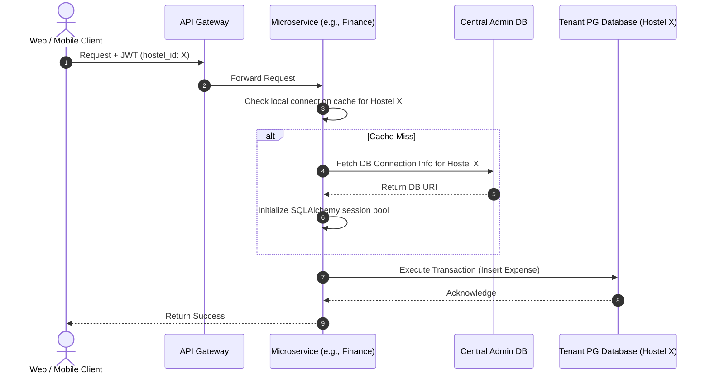

# Hostel Management System: Re-design Architecture Diagrams & Specs (Phase 1)

This document contains the microservices architecture designs for the **Hostel Management System (Phase 1)** supporting both **Mobile (React Native)** and **Web (React/Vite/Next.js)** clients, updated with the specific real-time and background notification channels.

---

## 1. Core Architectural Deciders

* **Frontend Clients**: 
  * **Mobile App**: Built using **React Native** for cross-platform (Android/iOS) coverage.
  * **Web App**: Built using **React** (via Vite or Next.js) to provide a desktop-grade dashboard interface for Super Admins and Hostel Owners.
* **Backend Framework**: **FastAPI** (Python) - Recommended for high-performance asynchronous operations, automatic Swagger/OpenAPI docs, and clean code separation.
* **Database Strategy**: **PostgreSQL** - Dynamic database-per-tenant (one database per hostel) with identical schemas.
* **Connection Management**: **PgBouncer** connection pooler sits in front of PostgreSQL to prevent connection limits being reached by tenant databases.
* **Document Storage**: **S3-compatible Storage** (AWS S3 for production, **MinIO** container for local development). Secure access via presigned URLs.
* **Async Event Handling**: **Redis** as a task queue/message broker for handling background alerts, snap-headcounts, and logging.

---

## 2. Integrated Notification Channels (Spec)

The system utilizes four distinct channels to handle alerts for Super Admins and Owners:

1. **Background Browser Push Notifications (Web Push API)**
   * **Backend**: Uses a Python web-push library with VAPID (Voluntary Application Server Identification) keys to securely sign and push payloads. Browser subscription details (endpoint, auth, and p256dh keys) are stored in the Central Admin DB.
   * **Frontend**: Registers a custom Service Worker (via Vite PWA/Workbox) to catch background `push` events when the tab is closed and triggers native browser system notifications using `self.registration.showNotification()`.
2. **Live In-App Notifications (WebSockets)**
   * **Backend**: Establishes persistent bidirectional connections via WebSockets (FastAPI WebSocket / Socket.io binding). Instantly targets active users by routing alerts to specific rooms using their User IDs.
   * **Frontend**: Listens for the `notification` event using socket clients to dynamically update UI states (e.g. updating the notification badge count) in real-time without requiring a page refresh.
3. **Transactional Emails (SMTP Relay)**
   * **Backend**: Sends email notifications (such as monthly invoices, passcode resets, and rent summaries) via a secure SMTP relay (Gmail SMTP or Brevo/Sendinblue relay) using Nodemailer (or Python's standard `aiosmtplib`).
4. **Local Foreground Notifications (Fallback)**
   * **Frontend**: In case Service Workers or WebSockets are unavailable or blocked, the active tab falls back to the browser's native `new Notification(title, body)` constructor combined with HTML5 audio pings for immediate visual/audio alert cues.

---

## 3. Microservices Architecture (Web & Mobile Support)

In the Microservices pattern, each business domain is run as an isolated containerized service. The API Gateway serves as a unified entrypoint, hiding the service complexity from both Mobile and Web clients.

### Microservices Diagram

### Service Descriptions:
1. **API Gateway (Kong / Traefik)**: Manages TLS/SSL termination, rate limiting, and routes incoming traffic from Web and Mobile clients based on path prefixes.
2. **Auth & Tenant Service**: Holds the central/admin metadata DB. Issues JWT tokens and maps owners/hostels to their database connection details.
3. **Hostel & Room Service**: Manages rooms, floors, hostelers, and room assignments. Connects dynamically to the tenant's PostgreSQL database.
4. **Finance & Inventory Service**: Manages income receipts, expense records, and assets. Connects dynamically to the tenant's database.
5. **Notification Service**: 
   * Listens for event messages on Redis (e.g., `rent_overdue`, `room_full`).
   * Establishes direct WebSocket connections to clients for live alerts.
   * Interfaces with external browser push services (Web Push API) and SMTP mail servers.
6. **Storage Service**: Integrates with MinIO/S3 and manages secure presigned URLs for viewing Aadhaar cards or receipt PDFs.

---

## 4. Dynamic Tenant DB Routing Flow

